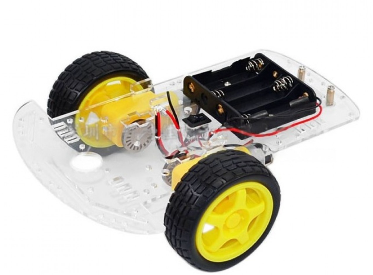
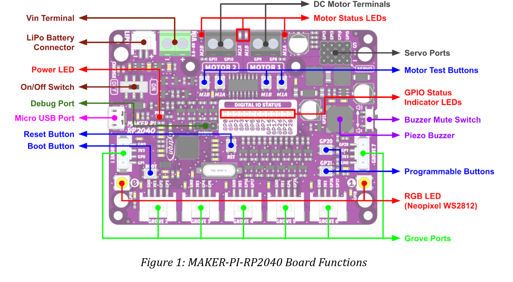
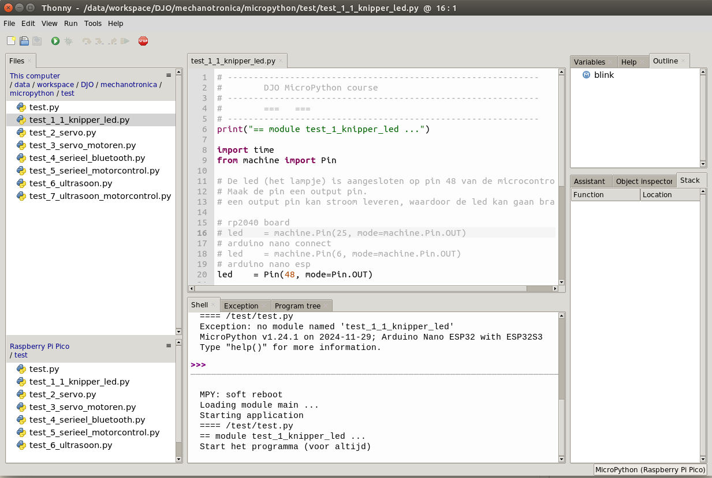

# Mechatronica: Micropython cursus
***

## [Home](../micropython-cursus.md)

## Inleiding

In deze cursus gaan we leren programmeren met Micropython.

We gaan dit doen met hulp van taken. Async programmeren, met een moelijk woord.

Wat hebben we hiervoor nodig:
* Een robot karretje met 2 gelijkstroom motoren
* Een besturings module. We gebruiken hiervoor de rp2040-pi-maker
* Een micro usb kabel
* Een laptop, met hierop het programma Thonny

## Het robot platform

Opmerking: we gebruiken niet de batterij houder voor 4 batterijen.
De robot krijgt stroom van een kleine lipo batterij. 

## rp2040-pi-maker

In de repository die bij het project hoort vind je de datasheet van de rp2040-pi-maker.

## Thonny, de programmeer omgeving

Thonny is de programmer omgeving waarmee we de robot gaan programmeren.

[Link naar website van Thonny](https://thonny.org/)

