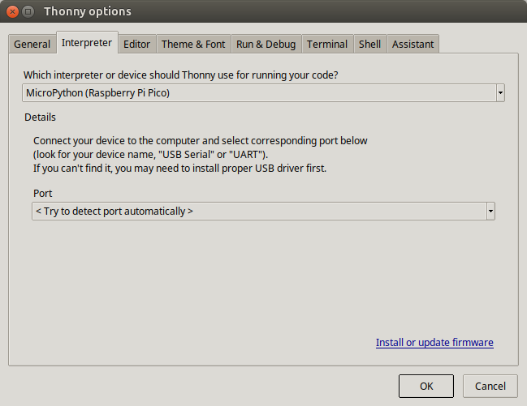

# Mechanotronica: Micropython cursus
***

## [Home](../micropython-cursus.md)

## Besturen van Leds

### Voorbereiding:
* Sluit het pi-maker board aan op de computer met de micro usb kabel
* Start het programma Thonny
* In Thonny kies bovenin het menu: **Run**
* Kies de bovenste optie in de lijst: **Select interpreter ...**
* kies de interpreter en de poort, zie volgend plaatje
* Je hoeft dit maar een keer te doen, Thonny onthoudt wat je gekozen hebt.
* 

### Test:
* Druk in Thonny op de rode Stop knop
* Als het goed is krijg je nu links 2 vensters: 
  * this computer
  * Raspberry Pi Pico

## 1.1 De eenvoudig manier van besturen van leds

* Druk op de stop knop in Thonny
* In het venster This computer ga naar 
  * mechanotronica/micropython/test
  * kies programma test_1_1_knipper.py
  * druk op de knop Run
  * Kijk wat er gebeurt

#
    test_1_1_knipper_led.py

    # De funktie blink
    def blink():
        led.on()
        time.sleep_ms(100)
        led.off()
        time.sleep_ms(500)

    print("Start het programma blink (voor altijd)")
    while True:
        blink()

### Zelf proberen:
  * Pas de **aan** tiid aan van het programma en start opnieuw
  * Pas de **uit** tijd aan van het programma en start opnieuw
  * Laat een andere ledje branden
  * probeer 2 ledjes tegelijkertijd te laten knipperen

## 1.2 De async manier van besturen van leds

* Met de async manier van programmeren is het mogelijk om heel veel taken tegelijkertijd (en onafhankelijk van elkaar) te doen
* Zo kan men makkelijk 8 leds aansturen, elk met een eigen knipper tempo
* Eigenschappen van een taak:
  * een taak begint altijd met het woord **async def**
  * een taak moet altijd minstens een regel hebben met het woord **await**
  * een taak heeft altijd een oneindige **while True** loop
  * heel veel taken kunnen tegelijkertijd uitgevoerd worden

#
    # Taak met 3 parameters: 
    async def task_blink_led(led, aan_tijd, uit_tijd):
        # Start de oneindige loop
        while True:
            led.value(0)
            await sleep_ms(aan_tijd)
            led.value(1)
            await sleep_ms(uit_tijd)

    # definieer de taken die we willen gaan uitvoeren
    # plaats een hekje (#) om de taak tijdelijk uit te schakelen
    create_task(task_blink_led( led2, 100, 1500))
    create_task(task_blink_led( led3, 100, 1800))
    create_task(task_blink_led( led4, 100, 2500))

    print("Start het programma test_1_1_knipper_async (voor altijd)")
    # volgende regel mag je niet uitschakelen
    run(task_blink_led( led1, 100, 1000))

### Zelf proberen:
  * Schakel all taken uit met een hekje, en laat alleen led1 knipperen
  * Schakel de taak voor led 2 weer aan
  * laat de leds in een ander tempo knipperen
  * pas de start_tijd van enkele leds aan en kijk wat er gebeurd
  * probeer 6 of 8   ledjes tegelijkertijd te laten knipperen, met verschillend tempo. 

