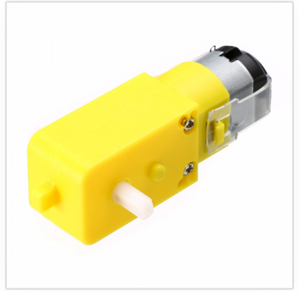

# Mechatronica: Micropython cursus
***

## [Home](../micropython-cursus.md)

## Gelijkstroom motoren

De motor die we voor onze robot gebruiken is een dc-motor met een vertragings kast
  * De dc-motor loopt heel snel
  * De vertragings kast vertraagt de motor met 1 op 48. Als de motor 48 keer rond gaat gaat het wiel maar 1x rond
* Kun je de dc-motor aanwijzen en de vertragings kast?

Het brein van de pi-maker (de rp2040) kan de motor niet direct aansturen. Daarvoor is een chip nodig. Dit is de chip tussen de motor test knoppen.

* Kun je de motor chip aanwijzen?
* Test de motor met de motor test knoppen

De motor wordt altijd aangestuurd met 2 IO poorten (A en B):

| MxA | MxB | functie|
|--- | ---| --- |
| 0| 0| De motor remt |
| 0| 1| Achteruit |
| 1| 0| Vooruit |
| 1| 1| De motor staat uit |

Naast de motor chip zitten 4 test knoppen om de motoren te testen.
Het testen werkt alleen als er geen programma aktief is in de rp2040 (rode stop knop).
Probeer de tabel hierboven met de test knoppen. Kun je het verschil voelen tussen de motor uit en de motor remt?

Elke motor is altijd ook een dynamo. Dus als je aan het wiel draait, maak je stroom.
Dit kun je testen door de rp2040 uit te schakelen. Draai nu aan het wiel. De motor leds gaan nu branden door de stroom die je maakt met de motor als dynamo.

## 2.1 De eenvoudig manier van besturen van de motor

We gaan de motor direct in het test programma aansturen
We kiezen motor 1 (m1A: pin 8 en m1B: pin 9)
  * We gaan de io pinnen van de motor in het testprogramma zetten
  * als in bovenstaande tabel

#
    def test_dc_motor():
        print("Motor vooruit")
        m1A.value(1)
        m1B.value(0)
        time.sleep(5)
        print("Motor vrijloop")
        m1A.value(1)
        m1B.value(1)
        time.sleep(1)
        print("Motor achteruit")
        m1A.value(0)
        m1B.value(1)
        time.sleep(5)
        print("Motor remmen")
        m1A.value(0)
        m1B.value(0)
        time.sleep(5)

    print("Start het programma test_2_1_dcmotor_simpel")
    while True:
        test_dc_motor()
 
 ### Zelf proberen:
  * maak de tijd van Motor remmen heel lang (bijvoorbeeld 10 sedonden)
  * Probeer het verschil te voelen tussen motor vrijloop en motor remmen, door aan het wiel te draaien
  

## 2.2 Besturen van de motor met Dcmotor object

Indien we de motor langzaam willen laten lopen, en ook langzaam willen laten optrekken dan wordt het iets moelijker. Te moeilijk om zelf te programmeren, daarom is er een Dcmotor object in de library.

Eerst moeten we het object importeren:

    from dcmotor import Dcmotor

Dan een dcmotor maken met 2 io pinnen voor MxA en MxB:

    dcmotor = Dcmotor(8,9)

De taak voor het testen van de motor:

    # Taak voor het testen van de motor
    async def task_test_motor():
      dcmotor.setMassa(5)  
      while True:
          print("Motor vooruit")
          dcmotor.setSpeed(99)
          await asyncio.sleep(5)
          print("Motor vrijloop")
          dcmotor.setSpeed(0)
          await asyncio.sleep(3)
          print("Motor achteruit")
          dcmotor.setSpeed(-99)
          await asyncio.sleep(5)
          print("Motor vrijloop")
          dcmotor.setSpeed(0)
          await asyncio.sleep(3)
  
Als laatste het maken van de taken en het opstarten van het programma

    # definieer de taken die we willen gaan uitvoeren
    asyncio.create_task(task_test_motor())
  
    print("Start het programma test_2_2_dcmotor_task")
    asyncio.run(dcmotor.task())

De taak dcmotor.task() zorgt ervoor dat de motor langzaam kan optrekken en afremmen (massa nabootsing)    

### Zelf proberen
* Zet de massa van de motor op 0 en kijk wat het verschil is
* Zet de massa van de motor op 9 en kijk wat het verschil is
* Zet een led 2 aan als de motor loopt, en zet de led uit als de motor stopt
