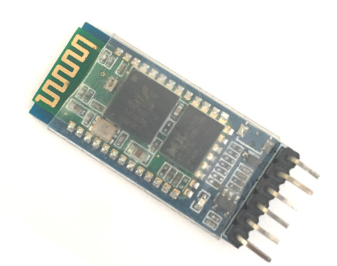

# Mechatronica: Micropython cursus
***

## [Home](../micropython-cursus.md)

## Bluetooth

Voor deze test gaan we een HC08 bluetooth module gebruiken

Deze module heeft een blauwe led
* die langzaam knippert, als er geen verbinding is. 
* die strak blauw is als er wel een verbinding is.

De bluetooth module is gekoppeld aan de UART 1 van de rp2040-rp-maker board. Verwarrend genoeg is dat aansluiting  GROVE3. 

Op de telefoon maken we gebruik van de Dabble App

Stappen:
* Installer de Dabble App op je android telefoon
* Zet bluetooth aan en koppel de robot (in de lijst te vinden als DJO_ROBOT)
* De pincode voor de bluetooth verbinding is 1234
* Start de Dabble App controller app
* In de app druk op de connect knop rechtsboven) en verbind met de DJO_ROBOT-*
* Open de tegel GamePad.

### test 4.1 Eenvoudige bluetooth test

In de library vinden we de Dabble en Gamepad class.

Eerst dienen we deze te importeren, en vervolgens te maken:

    from dabble import Dabble, Gamepad
    # bluetooth module verbonden met Grove port 3. Dit is uart nummer 1
    dabble = Dabble(1)
    g = Gamepad(dabble)

Dan maken we de test

    async def show_task():
        while True:
            await asyncio.sleep_ms(300)
            print("snelheid:%s  richting:%s  start:%s  "%( g.snelheid(), g.richting(),g.isStart()))
            #print("hoek:%s  straal:%s  start:%s  "%( g.hoek(), g.straal(),g.isStart()))
            #print("select:%s  square:%s  triangle:%s  circle%s  cross:%s"%( g.isSelect(), g.isSquare(), g.isTriangle(), g.isCircle(), g.isCross()))

De gamepad kan de joystick laten zien 
* in de vorm van hoek en straal.
  hoek:
  * 0  naar rechts
  * 6  naar boven
  * 12  naar rechts
  * 18  naar beneden

  Straal is een getal van 0 tot en met 7.
* in de vorm van snelheid (-85 .. 85) en richting (-85..85)  

### Zelf uitproberen:
  * druk op diverse knoppen van de gamepad in de Dabble App
  * Zet een hash voor de eerste print regel, en verwijder de hash van de 2e printregel
  * Zet een hash voor de twee print regel, en verwijder de hash van de 3e print regel
  * Kijk of je snapt wat er gebeurd. 

### test 4.2 Bluetooth test met meerdere taken

  Een groot programma maken we door het programma in kleine taken te splitsen.

  Elke taak krijgt hierbij een enkele functie, die makkelijker te snappen en te testen is.

  We hebben in test_4_2_bluetooth_tasks de taken:

  | naam| functie| opmerking |
  | --- | --- | --- |
  |task_blink| hartbeat led| De hartbeat gebruiken om te zien of het programma nog aktief is|
  |task_command| app functie | Deze taak bevat de user interface logica van ons programma. Hier bepalen we hoe we de robot kunnen besturen
  |dabble.task|Ontvangen en zenden van Bluetooth data| Telkens als er een regel ontvangen is gaat led 28 kort aan. Deze taak is te vinden in micropython/lib/dabble.py|
  
### taak voor het knipperen van de led als heartbeat van het programma

    async def task_blink():
      print("Start taak task_blink")  
      while True:
        led.on()
        await asyncio.sleep_ms(100)
        led.off()
        await asyncio.sleep_ms(900)

### taak voor het wachten op een BT regel en deze omzetting in een commando

    # taak voor het wachten op een BT regel en deze omzetting in een commando
    async def task_command():
      print("Start taak task_command")
      while True:
        # zorg dat andere taken ook tijd krijgen
        await asyncio.sleep_ms(100)
        if gamepad.buttonPressed():
          if gamepad.isStart():
              print("start")
          if gamepad.isSelect():
              print("select")
          if gamepad.isSquare():
              print("vierkant")
          if gamepad.isTriangle():
              print("driehoek")
          if gamepad.isCircle():
              print("cirkel")
          if gamepad.isCross():
              print("kruisje")

## Opmerking

Bijna elke taak bevat de regel:

        await asyncio.sleep_ms(xxx)

Deze regel is heel belangrijk voor de werking van het programma
Hiermee zegt de taak: ik heb even niks te doen. Op dat moment krijgen andere taken de aandacht. 

Zonder deze regel is er maar 1 taak aktief, en de andere taken komen niet meer aan bod.

De taak van de task_blink is om te laten zien dat het programma nog "leeft". Men noemt deze taak ook wel de hartbeat taak.

