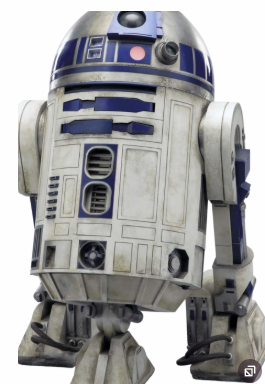

# Mechanotronica: Micropython cursus
***

## [Home](../micropython-cursus.md)

## R2d2 besturen

### De meest beroemde en geliefde robot in the universe: r2d2:

We noemen onze robot R2d2. Eigenlijk is dat een grapje want de echte r2d2 was een heel slimme robot, die veel meer kan dan alleen maar heen en weer rijden.

### 3.1 Werken met R2d2

In de library vinden we het R2d2 object.

Eerst dienen we deze te importeren:

    from r2d2 import R2d2

Dan maken we een r2d2 object. We geven de pinnummers voor de motoren mee m1a, m1b, m2a, m2b.
Voor het rp2040-pi-maker is dit 8, 9, 10, 11.

    r2d2 = R2d2(1 ,2, 5, 6)  

Vervolgens de test taak:

    # Test Taak 
    async def task_test_r2d2():
        r2d2.setMassa(1)
        while True:
            print("vooruit")
            r2d2.move(99, 99)
            await asyncio.sleep(5)
            print("Linksom")
            r2d2.move(99, 0)
            await asyncio.sleep(5)
            print("Achteruit")
            r2d2.move(-99, -99)
            await asyncio.sleep(5)
            print("Rechtsom")
            r2d2.move(-99, 0)
            await asyncio.sleep(5)

En defineren en starten de taak:

    # definieer de taken die we willen gaan uitvoeren
    asyncio.create_task(task_test_r2d2())

    print("Start de asyncio loop")
    asyncio.run(r2d2.task())

De taak r2d2.task() is belangrijk. Deze taak zorgt ervoor dat de motoren aangestuurd kunnen worden, en dat de motor langzaam kan optrekken en afremmen.

### Zelf uitproberen:
  * Zet de massa van de robot op 9 en kijk wat er gebeurt
  * Zet de massa van de robot op 0 en kijk wat er gebeurt
  * Laat de robot een vierkant rijden en dan stoppen
  * Laat de robot een letter A rijden

### Voor de nieuwsgierigen:
  * Bekijk de file lib/r2d2.py Dit is de library  die het object R2d2 bevat. Kijk hoever je komt om te stappen wat hier gebeurd. 
  

